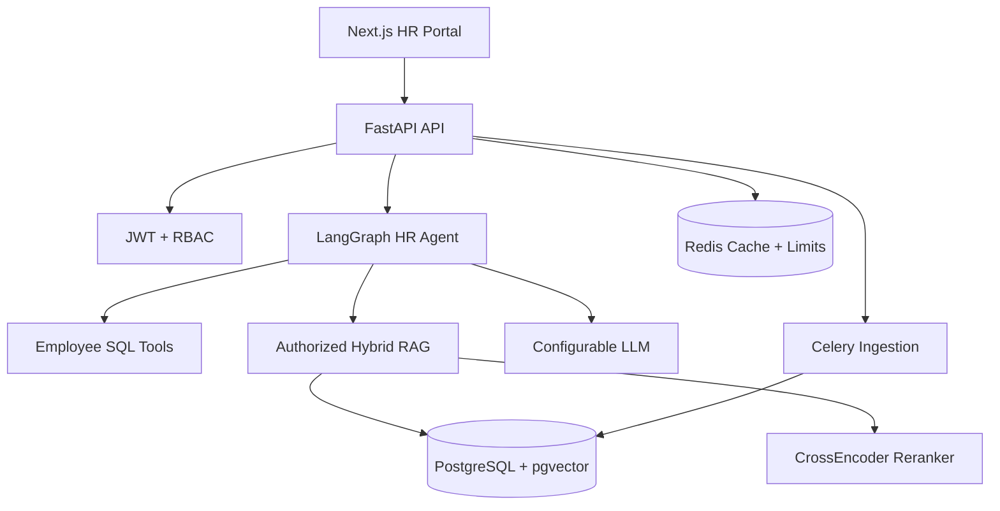

# Architecture

## Trust boundaries

1. The API authenticates the user and creates a server-owned `AccessScope`.
2. The client never supplies its role, department or allowed visibility.
3. Retrieval SQL receives the server-owned scope and filters candidates before ranking.
4. The LLM only sees already-authorized chunks and least-privilege structured results.
5. Returned citation IDs are checked against retrieved chunks. Fabricated citations are removed.
6. Every administrative mutation and assistant request creates an audit event.

## Data model

- `users`: identity, password hash and role.
- `employees`: HR profile and department, one-to-one with a user.
- `leave_balances` / `leave_requests`: structured employee facts.
- `documents`: current source metadata, audience, department scope and indexing status.
- `document_versions`: immutable file/version history.
- `document_chunks`: page-aware text, FTS vector, embedding and inherited access metadata.
- `conversations` / `messages`: persisted multi-turn context and answer metadata.
- `audit_events`: append-only security and operational trail.

## Role visibility matrix

| User role | Allowed document visibility |
|---|---|
| Employee | `public`, `employee` |
| Manager | `public`, `employee`, `manager` |
| HR | `public`, `employee`, `manager`, `hr` |
| Admin | all including `admin` |

A department-scoped document additionally requires a matching employee department. Global documents have `department_id = NULL`.

